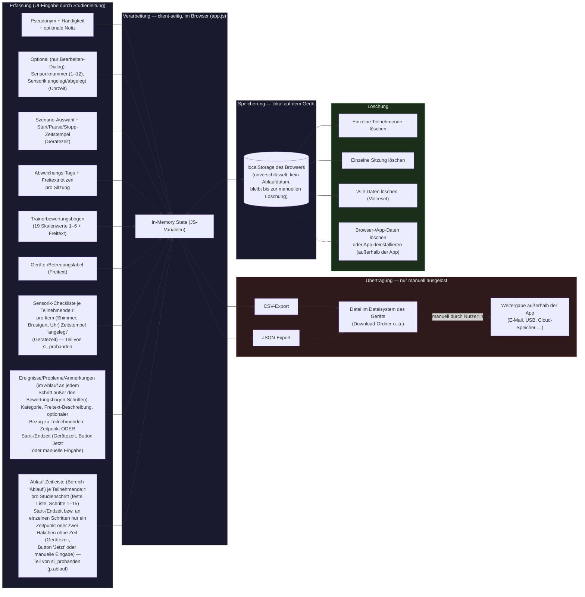

# StudyLog-V2 — Datenfluss (Grundlage für Datenschutz-Bewertung)

> Diese Datei dokumentiert, welche Daten die App erfasst, wo sie entstehen, wie/wo sie
> verarbeitet und gespeichert werden, ob/wohin sie übertragen werden, und wie sie gelöscht
> werden. Offene Punkte sind explizit mit **"TODO: Datenschutz prüfen"** markiert. Diese
> Datei ersetzt keine rechtliche Prüfung, sondern liefert den technischen Ist-Zustand dafür.

## Grundprinzip

Die App verarbeitet alle Daten **ausschließlich lokal im Browser des jeweiligen Geräts**.
Es gibt keinen Server, kein Backend, keine Cloud-Synchronisation und keine automatische
Übertragung an Dritte. Der einzige Weg, Daten aus der App herauszubekommen, ist ein
**manuell ausgelöster CSV/JSON-Export**, der eine Datei auf dem Gerät erzeugt.

Personen werden ausschließlich unter **Pseudonym** (Format erzwungen: 1 Buchstabe, 4 Zahlen,
3 Buchstaben, z. B. `P1234ABC`) geführt; optional zusätzlich eine **Sensoriknummer** (1–12,
nur im Bearbeiten-Dialog). Die Zuordnung Pseudonym ↔ Klarname wird laut
Projekt-README **außerhalb der App**, separat bei der Studienleitung, geführt — die App
selbst kennt diese Zuordnung nicht. Das entspricht einer Pseudonymisierung nach
Art. 4 Nr. 5 DSGVO, **sofern** die externe Zuordnungsliste tatsächlich getrennt und
zugriffsgeschützt aufbewahrt wird. TODO: Datenschutz prüfen — die Existenz, Aufbewahrung
und Zugriffsberechtigung dieser externen Zuordnungsliste liegt außerhalb des Codes und
kann hier nicht verifiziert werden.

## Diagramm: Datenfluss

Rot hinterlegt (Transfer) markiert den Punkt, ab dem Daten die Kontrolle der App verlassen:
Sobald eine CSV/JSON-Datei exportiert wurde, entscheidet die Studienleitung eigenverantwortlich
und außerhalb der App, wie/wohin diese Datei weitergegeben wird (Zusammenführen mehrerer
Geräte-Exporte laut README z. B. in Excel/R/Python). TODO: Datenschutz prüfen — Aufbewahrung,
Zugriffsschutz und Löschfristen für exportierte Dateien sind nicht Teil der App und sollten
organisatorisch (nicht technisch) geregelt und für die DSFA dokumentiert werden.

## Datentypen im Detail

Gespeichert wird in neun getrennten `localStorage`-Einträgen (Keys `sl_probanden`,
`sl_sessions`, `sl_settings`, `sl_scenarios`, `sl_tags`, `sl_bewertungen`, `sl_events`,
`sl_event_tags`, `sl_hologate_labels`).

| Datentyp | Felder (Auszug) | Zweck | Rechtsgrundlage | Speicherort | Aufbewahrungsdauer | Verantwortlichkeit |
|---|---|---|---|---|---|---|
| **Teilnehmenden-Stammdaten** (`sl_probanden`) | Pseudonym, Händigkeit (Pflichtfeld: „Rechts" oder „Links"), Sensoriknummer (1–12, **optional** — nur im Bearbeiten-Dialog), optionale Freitextnotiz, Zeitpunkt Sensorik an-/abgelegt, Sensorik-Checkliste (`sensorik`: pro Item Shimmer / Brustgurt / Uhr ein Zeitstempel „angelegt am", ISO 8601, Gerätezeit; **keine** Rohsensordaten), Ablauf-Zeitleiste (`ablauf`: pro Studienschritt Start-/Endzeit als ISO 8601 [Gerätezeit]; ein früheres Freitext-Anmerkungsfeld je Schritt entfiel seit v2.30.0, siehe Zeile „Ereignisse/Probleme/Anmerkungen" unten), Erstellungszeitpunkt | Zuordnung von Sitzungen zu Testpersonen ohne Klarnamen; Händigkeit relevant für Sensorplatzierung; Dokumentation, wann welche Sensorik bei welcher Person angelegt wurde und wann welcher Studienschritt begonnen/beendet wurde | TODO: Datenschutz prüfen | `localStorage`, lokal auf dem jeweiligen Gerät | Unbegrenzt, bis manuelle Löschung (einzeln oder "Alle Daten löschen") | Jeweilige Studienleitung / Gerätebesitzer:in |
| **Ablauf-Zeitleiste** (Teil von `sl_probanden`, `p.ablauf`) | Pro Studienschritt (feste Schrittfolge Schritte 1–15, seit v2.32.0) je ein Objekt `{ startISO, endISO, note, noteISO, done?, dataSecured?, disinfected? }`: Start-/Endzeitpunkt (ISO 8601, Gerätezeit, per Button „Jetzt" oder manueller Uhrzeit-Eingabe) sowie an den Fragebogen-Schritten 3/5/9/12 `done` = ISO-Zeitstempel der Bestätigung „Fragebogen ausgefüllt" (manuell per Checkbox). `note`/`noteISO` (Freitext-Anmerkung je Schritt + Uhrzeit der ersten Erfassung) hatten bis v2.29.x ein eigenes Eingabefeld; **seit v2.30.0 entfällt dieses Feld** (inhaltlich doppelt zu „Ereignisse/Probleme/Anmerkungen", siehe eigene Zeile) — bereits vorhandene Alt-Werte bleiben in den Daten erhalten, werden aber nicht mehr angezeigt oder neu gesetzt. Schritt 13 „Stop Sensorik" erfasst seit v2.32.0 nur noch `startISO` als **einzelnen** Zeitpunkt („Aufzeichnung beendet"), `endISO` bleibt leer. Der letzte Schritt „Datensicherung/Desinfektion" trägt seit v2.32.0 **keine Zeitstempel mehr**, sondern zwei reine Häkchen `dataSecured`/`disinfected` (boolesch, **ohne** ISO-Zeitpunkt) — „Alle Daten gesichert" (LSL, App, Sensorik, Varjo Base) und „Alles desinfiziert/aufbereitet"; sind beide gesetzt, kann direkt der nächste Durchlauf (nächste:r Teilnehmende:r) gestartet werden, ohne dass dabei Daten der aktuellen Person verändert werden. Am selben letzten Schritt wird seit v2.33.0 zusätzlich (nur informativ, kein eigenes Feld) die **Gesamtdauer** angezeigt — Zeitspanne inkl. Datum vom Anlegen der/des Teilnehmenden (`createdAt`) bis zum letzten erfassten Sensorik-Ablege-Zeitpunkt (`p.sensorikAblegen`, Schritt 14), berechnet on-the-fly von `ablaufDurationInfo()`. Schritte 1, 2, 7, 10, 14 sowie 8, 11 (Trainerbewertungsbogen) und alle Fragebogen-Schritte 3/5/9/12 sowie der letzte Schritt haben keine Start/Ende-Felder (Schritt 1: Person anlegen; Schritt 2: Sensorik-Checkliste anlegen; Fragebogen-Schritte: nur die Checkbox „Fragebogen ausgefüllt", siehe eigene Zeile; Schritt 7/10: die Zeiten stecken im jeweiligen VR-Szenario-Durchlauf, siehe eigene Zeile; Schritt 8/11: Trainerbewertungsbogen, kein Timer; Schritt 14: Sensorik-Ablege-Checkliste, siehe „Sensorik-Zeiten & -Checkliste"; letzter Schritt: siehe oben). **Schritt 6 (Tutorial) hat seit v2.28.0 wieder normale Start-/Ende-Felder** wie Schritt 4 „TMS" (zwischen v2.26.0 und v2.27.x wurde die Zeit stattdessen über einen eigenen Szenario-Durchlauf erfasst, siehe Zeile „VR-Szenario-Durchläufe" unten und Migration in `docs/ARCHITECTURE.md`) — seit v2.29.1 mit Beschriftung „Start (VR-Tutorial)"/„Ende (VR-Tutorial)" und Hinweistext, um klarzustellen, dass explizit das VR-Szenario-Tutorial gemeint ist und nicht die vorangehende Einweisung bzw. der gesamte Schritt. Fehlender Schlüssel = Schritt für diese Person noch nicht erfasst. Personenbezug über die Zuordnung zum pseudonymisierten Datensatz | Zeitliche Protokollierung des realen Studienablaufs je Teilnehmende:r (Ersatz/Ergänzung zum bisherigen reinen Szenario-Timer), inkl. schrittbezogener Anmerkungen | TODO: Datenschutz prüfen | `localStorage`, lokal | Unbegrenzt, bis manuelle Löschung (Schritt einzeln über „Schritt leeren", Person löschen oder "Alle Daten löschen") | Jeweilige Studienleitung / Gerätebesitzer:in |
| **Trainerbewertungsbögen im Ablauf** (Teil von `sl_probanden`, `p.bewertungen`) | Objekt `{ [stepId]: [ { id, label, scores, notes, savedAt } ] }` — von der VR-Leitung an dem **eigenen** Ablauf-Schritt 8 (bewertet alle Hologate-Szenarien aus Schritt 7 gemeinsam, ohne das Tutorial aus Schritt 6) bzw. Schritt 11 (bewertet nur den Rollercoaster-Durchlauf aus Schritt 10, inkl. des in der Szene enthaltenen Schießens) ausgefüllt, während die Teilnehmenden den anschließenden Fragebogen (Schritt 9 bzw. 12) bearbeiten. Bis v2.26.1 war der Bogen an den damaligen Fragebogen-Schritten eingebettet, seit v2.27.0 eigener Schritt; **seit v2.29.0 direkt im Schritt ausfüllbar statt über ein Overlay/„anlegen"-Button** — genau ein Bogen pro Schritt (Index 0 in `p.bewertungen[stepId]`), `label` fest = Default („Hologate (gesamt)" bzw. „Rollercoaster", nicht mehr per UI änderbar), jede Antwort speichert sofort beim Antippen der Note (Anmerkung beim Verlassen des Felds). „Bewertung zurücksetzen" leert Antworten + Anmerkung nach Rückfrage. Beide Bewertungsbogen-Schritte haben **keinen** Ereignis-Abschnitt. Seit v2.16.0 **reduziert** auf den Block „Vergleich zur Selbsteinschätzung" (4 Skalenwerte 1–6, spiegeln inhaltlich den Teilnehmerfragebogen). Personenbezug über den pseudonymisierten Datensatz. Löst den früheren, `sessionId`-basierten Bogen (`sl_bewertungen`) ab; `sl_bewertungen` bleibt für Alt-Daten bestehen | Fremdeinschätzung je VR-Durchlauf, Grundlage für Selbst-/Fremd-Vergleich | TODO: Datenschutz prüfen — Bewertungsdaten zu einer (pseudonymisierten) Person können besonders schutzwürdig sein | `localStorage`, lokal | Unbegrenzt, bis manuelle Löschung (Bewertung zurücksetzen, Person löschen oder "Alle Daten löschen") | Jeweilige Studienleitung / Gerätebesitzer:in |
| **Ereignisse/Probleme/Anmerkungen im Ablauf** (Teil von `sl_probanden`, `p.ereignisse`) | Array `[ { id, stepId, tag (Kategorie), note (Freitext), type, timeISO ODER startISO/endISO, createdAt } ]` — je Ablauf-Schritt (außer den Bewertungsbogen-Schritten 8/11) erfassbare Einträge (z. B. „Brustgurt verrutscht", aber seit v2.30.0 auch freie Anmerkungen ohne Problembezug — Kategorie `Sonstiges`), Zeitpunkt oder Zeitraum (Gerätezeit, Button „Jetzt" oder manuell). Kategorien aus `eventTags` (Default: Sensorik/VR/Fragebogen/TMS/Sonstiges). Löst den früheren globalen `sl_events`-Tab **und** den früheren separaten Anmerkung-Punkt je Schritt ab; `sl_events` bleibt für Alt-Daten bestehen | Dokumentation von Störungen/Auffälligkeiten sowie freien Anmerkungen im Ablauf, je Person und Schritt | TODO: Datenschutz prüfen | `localStorage`, lokal | Unbegrenzt, bis manuelle Löschung (Eintrag einzeln, Person löschen oder "Alle Daten löschen") | Jeweilige Studienleitung / Gerätebesitzer:in |
| **VR-Szenario-Durchläufe im Ablauf** (Teil von `sl_probanden`, `p.szenarien`) | Objekt `{ [stepId]: [ { id, label (Freitext), phases } ] }` je Schritt 7 (Hologate) und 10 (Rollercoaster). `phases` = Teilschritte je Durchlauf; seit v2.32.2 an **beiden** Schritten ausschließlich `p_start`/`p_end` (je ein ISO-8601-Zeitstempel, Gerätezeit) — an Schritt 10 gab es bis v2.32.1 vier zusätzliche reine Häkchen-Phasen ohne Zeitwert (Person kalibriert/Person durchläuft das Szenario/Brille abgezogen/Selbstbewertung+Bewertungsbogen), die auf Wunsch ersatzlos entfielen; bereits erfasste Alt-Werte dieser vier Phasen bleiben unverändert in `localStorage` stehen, werden aber nicht mehr angezeigt oder bearbeitet. **Seit v2.29.0** werden die beiden Zeit-Phasen über ein normales Zeit-Eingabefeld erfasst/korrigiert (Button „Jetzt" oder manuelle Eingabe, wie bei den übrigen Schritt-Zeitfeldern). **Schritt 7:** genau **5 feste Durchläufe** (Scheiben, Köpfe, Laufen, Drohnen, Kombi — nicht änderbar), je nur „Szenario starten" + „Szenario beendet". **Schritt 10:** seit v2.32.0 genau **1 fester Durchlauf** (zuvor frei anlegbare Durchläufe über ein Overlay, seither entfernt) — Start/Ende dieses Durchlaufs sind die **einzige** Zeiterfassung an Schritt 10 (die frühere zusätzliche Schritt-Zeit wurde beim Umstieg dorthin übernommen, siehe Migration in `docs/ARCHITECTURE.md`). Personenbezug über den pseudonymisierten Datensatz. **Schritt 6 (Tutorial) ist seit v2.28.0 nicht mehr Teil dieses Datentyps** — bereits erfasste Zeitstempel wurden beim Laden einmalig nach `p.ablauf.fs_06.startISO`/`endISO` migriert (siehe oben) | Zeitliche Feingliederung des VR-Szenario-Ablaufs je Durchlauf | TODO: Datenschutz prüfen | `localStorage`, lokal | Unbegrenzt, bis manuelle Löschung (Durchlauf einzeln [Schritt 10], Person löschen oder "Alle Daten löschen") | Jeweilige Studienleitung / Gerätebesitzer:in |
| **Sitzungsprotokolle** (`sl_sessions`) | Verweis auf Teilnehmende:n (Pseudonym+Sensoriknummer als Kopie), gewähltes Szenario, Start-/Endzeitpunkt (ISO 8601), aktive Dauer, Pausen (je Start-/Endzeitpunkt + Dauer, beliebig oft pro Sitzung), Abweichungs-Tags, Freitextnotizen, Gerätelabel | Nachvollziehbarkeit des Sitzungsablaufs inkl. Unterbrechungen, Basis für Auswertung/Export | TODO: Datenschutz prüfen | `localStorage`, lokal | Unbegrenzt, bis manuelle Löschung | Jeweilige Studienleitung / Gerätebesitzer:in |
| **Trainerbewertungsbogen** (`sl_bewertungen`) | Verweis auf Sitzung, 19 Skalenwerte (Schulnoten-Skala 1–6) zu Leistungsdimensionen (u. a. Lageerkundung, Entscheidungsqualität, Führung/Kommunikation, MANV-Erkennung), Freitextanmerkungen | Strukturierte Leistungsbewertung der Teilnehmenden im Szenario | TODO: Datenschutz prüfen — Bewertungsdaten zu einer identifizierbaren (wenn auch pseudonymisierten) Person können besonders schutzwürdig sein | `localStorage`, lokal | Unbegrenzt, bis manuelle Löschung | Jeweilige Studienleitung / Gerätebesitzer:in |
| **Sensorik-Zeiten & -Checkliste** (Teil von `sl_probanden`) | Uhrzeit "Sensorik angelegt" / "Sensorik abgelegt" sowie zwei getrennte Checklisten mit je einem Zeitstempel „angelegt am" bzw. „abgelegt am" pro Item Shimmer / Brustgurt / Uhr: `p.sensorik` (Ablauf-Schritt 2 „Anlegen Sensorik") und, seit v2.32.0, `p.sensorikAblegen` (Ablauf-Schritt 14 „Sensorik ablegen" — eigener, unabhängiger Datenspeicher, dieselben drei Items). Alles manuell erfasst, **keine** Rohsensordaten. Personenbezug über die Zuordnung zum pseudonymisierten Datensatz | Dokumentation des Sensorhandlings (An- und Ablegen) im Studienablauf je Person | TODO: Datenschutz prüfen | `localStorage`, lokal | Unbegrenzt, bis manuelle Löschung (Item-Reset im jeweiligen Schritt, Person löschen oder "Alle Daten löschen") | Jeweilige Studienleitung / Gerätebesitzer:in |
| **Ereignisse** (`sl_events`) | Kategorie (Tag), Freitext-Beschreibung, optionaler Verweis auf Teilnehmende:n (Pseudonym als Kopie, oder ohne Personenbezug), entweder ein Zeitpunkt (`timeISO`) oder ein Zeitraum (`startISO`/`endISO`/`duration_s`), Erstellungszeitpunkt | Dokumentation von Ereignissen/Problemen während der Studiendurchführung (z. B. Sensorik verrutscht), unabhängig von einer konkreten Sitzung | TODO: Datenschutz prüfen | `localStorage`, lokal auf dem jeweiligen Gerät | Unbegrenzt, bis manuelle Löschung (einzeln oder "Alle Daten löschen") | Jeweilige Studienleitung / Gerätebesitzer:in |
| **Szenario-, Tag- & Ereigniskategorie-Konfiguration** (`sl_scenarios`, `sl_tags`, `sl_event_tags`) | Name/Abkürzung/Icon der Szenarien, Liste möglicher Abweichungs-Tags, Liste möglicher Ereignis-Kategorien (Default: Sensorik, VR, Fragebogen, TMS, Sonstiges) — Ereignis-Kategorien seit v2.31.0 auch aus den **Einstellungen** heraus bearbeitbar/erweiterbar (⚙-Icon → „Kategorien verwalten") | App-Konfiguration, keine Personenbezug | Nicht personenbezogen | `localStorage`, lokal | Unbegrenzt (wird von "Alle Daten löschen" **nicht** erfasst) | Jeweilige Studienleitung / Gerätebesitzer:in |
| **Bezeichnungen der Hologate-Durchläufe** (`sl_hologate_labels`) | Genau 5 Freitext-Bezeichnungen (Default: Scheiben, Köpfe, Laufen, Drohnen, Kombi) für die festen Durchläufe an Ablauf-Schritt 7 — in den **Einstellungen** editierbar (Reihenfolge/Anzahl fest, nur der Text je Position änderbar), mit „Auf Standard zurücksetzen" | App-Konfiguration, kein Personenbezug | Nicht personenbezogen | `localStorage`, lokal | Unbegrenzt (wird von "Alle Daten löschen" **nicht** erfasst) | Jeweilige Studienleitung / Gerätebesitzer:in |
| **Einstellungen** (`sl_settings`) | Geräte-/Betreuungslabel (Freitext), Zeitpunkt letzter Export; `multiProband` (Alt-Feld, seit v2.31.0 ohne UI-Zugriff, bleibt dauerhaft `false` — betraf nur die inzwischen unerreichbaren Sitzungsaufzeichnungs-/Bewertungs-Screens) | App-Konfiguration und Exportnachweis | Nicht personenbezogen (kann ggf. Namen enthalten, falls Studienleitung sich selbst dort einträgt) | `localStorage`, lokal | Unbegrenzt (wird von "Alle Daten löschen" **nicht** erfasst) | Jeweilige Studienleitung / Gerätebesitzer:in |
| **Export-Dateien** (CSV/JSON) | Seit v2.33.0: alle Ablauf-Daten **jeder/jedes Teilnehmenden** auf diesem Gerät (Zeiten je Schritt, Sensorik-Checklisten, VR-Szenario-Durchläufe, Trainerbewertungsbögen, Ereignisse/Probleme/Anmerkungen, berechnete Gesamtdauer) — siehe Zeilen oben. **Die Alt-Keys `sl_events`/`sl_sessions`/`sl_bewertungen` sind weiterhin nicht Teil des Exports** (Export basiert nicht mehr auf ihnen, sie verbleiben ausschließlich in `localStorage`) | Zusammenführung/Auswertung mehrerer Geräte nach Studienabschluss | TODO: Datenschutz prüfen | Dateisystem des Geräts (Download-Ordner), danach außerhalb der App-Kontrolle | Unbestimmt — liegt außerhalb der App | TODO: Datenschutz prüfen — vermutlich Studienleitung/Institution |

## Löschverhalten im Detail (technisch verifiziert im Code)

- **Einzelne:n Teilnehmende:n löschen:** Entfernt den Stammdatensatz aus `sl_probanden`
  (inkl. `p.sensorik`, `p.sensorikAblegen`, `p.ablauf`, `p.bewertungen`, `p.ereignisse` und
  `p.szenarien`).
  Bereits gespeicherte Sitzungen (`sl_sessions`) und Bewertungen (`sl_bewertungen`) dieser
  Person **bleiben erhalten** (Pseudonym/Sensoriknummer sind dort als Kopie hinterlegt) —
  die App weist beim Löschen explizit darauf hin. TODO: Datenschutz prüfen — im Hinblick auf
  ein Recht auf Löschung (Art. 17 DSGVO) sollte bewertet werden, ob dieses Verhalten
  gewünscht/ausreichend ist.
- **Einzelne Sitzung löschen:** Entfernt genau diesen Eintrag aus `sl_sessions`. Zugehörige
  Bewertungsbogen-Einträge in `sl_bewertungen` werden dabei **nicht** automatisch mitgelöscht
  (verwaister Verweis über `sessionId` bleibt bestehen). TODO: Datenschutz prüfen.
- **"Alle Daten löschen" (Einstellungen-Overlay):** Leert `sl_probanden` (inkl. `p.sensorik`,
  `p.sensorikAblegen`, `p.ablauf`, `p.bewertungen`, `p.ereignisse`, `p.szenarien`), `sl_sessions`,
  `sl_bewertungen` und `sl_events` sowie den Zeitstempel des letzten Exports vollständig. **Nicht** betroffen
  sind die Szenario-Konfiguration (`sl_scenarios`), die Tag-Liste (`sl_tags`), die
  Ereignis-Kategorien (`sl_event_tags`), die Hologate-Durchlauf-Bezeichnungen
  (`sl_hologate_labels`) und das Geräte-/Betreuungslabel
  (`sl_settings.deviceLabel`) — diese gelten als reine App-Konfiguration ohne Personenbezug.
- **Einzelnes Ereignis löschen (Tab „Ereignisse"):** Entfernt genau diesen Eintrag aus
  `sl_events`, nach Sicherheitsabfrage. Es gibt keine Detail-/Bearbeiten-Ansicht für
  Ereignisse — Korrekturen erfolgen durch Löschen + Neuanlage.
- **"Zurücksetzen" im Tab Sensorik / an Ablauf-Schritt 2 bzw. 14:** Setzt `p.sensorik = {}`
  (Schritt 2 „Anlegen Sensorik") bzw. seit v2.32.0 `p.sensorikAblegen = {}` (Schritt 14
  „Sensorik ablegen") für die aktive Person (nach Sicherheitsabfrage), sodass die jeweilige
  Checkliste wieder leer ist. Die beiden Checklisten sind unabhängig voneinander — ein Reset
  der einen lässt die andere unverändert. Andere Personen und die feste Item-Liste bleiben
  unverändert.
- **"Schritt leeren" im Bereich Ablauf:** Verfügbar an Schritten mit Start+Ende-Feldern
  **oder** dem einzelnen Zeitpunkt-Feld (Schritt 13, siehe oben). Entfernt die erfasste(n)
  Zeit(en) des betreffenden Schritts aus `p.ablauf` der aktiven Person (nach
  Sicherheitsabfrage), sodass dieser Studienschritt wieder als „offen" gilt; ein evtl. noch
  vorhandenes Alt-`note` bleibt erhalten (sonst wird der Eintrag automatisch verworfen).
  Andere Schritte und Personen bleiben unverändert. Die Sensorik-Checklisten (Schritt 2/14),
  die Fragebogen-Checkbox, die Trainerbewertungsbögen und die zwei Datensicherung-Häkchen
  (letzter Schritt) haben je ihre eigene Rückgängig-/Umschalt-Funktion statt „Schritt leeren".
- **CSV/JSON-Export (seit v2.33.0 auf der Ablauf-Datenstruktur):** Der Export exportiert
  **alle** Teilnehmenden auf diesem Gerät mit allen im Ablauf erfassten Daten — `p.ablauf`
  (Zeiten je Schritt), `p.sensorik`/`p.sensorikAblegen` (Checklisten), `p.szenarien`
  (VR-Szenario-Durchläufe), `p.bewertungen` (Trainerbewertungsbögen) und `p.ereignisse`
  (Ereignisse/Probleme/Anmerkungen). CSV: eine Zeile pro Teilnehmende:r mit einer Spalte je
  Schritt-Feld (Ereignisse als ein zusammengefasster Text pro Zeile, analog zur bestehenden
  Pausen-Zusammenfassung bei `sl_sessions`); JSON: volle, verschachtelte Struktur je
  Teilnehmende:r inkl. aller ISO-Zeitstempel — siehe [ARCHITECTURE.md](./ARCHITECTURE.md).
  Der frühere, `sl_sessions`/`sl_bewertungen`-basierte Export lieferte auf einem regulär nur
  über den Ablauf genutzten Gerät nie Daten (diese Keys sind dort stets leer) und ist damit
  abgelöst; die Alt-Keys selbst bleiben unverändert in `localStorage` bestehen.
- **Kein automatischer Ablauf/keine Aufbewahrungsfrist:** Die App löscht nichts von selbst.
  Daten bleiben im `localStorage` des Browsers bestehen, bis eine der obigen Aktionen manuell
  ausgeführt wird, oder bis Nutzer:innen außerhalb der App Browserdaten löschen bzw. die App
  deinstallieren (browser-/betriebssystemabhängig, nicht von der App steuerbar).
- **Keine Verschlüsselung durch die App:** `localStorage` wird unverschlüsselt durch die App
  genutzt; ein etwaiger Schutz hängt von Geräteverschlüsselung/Bildschirmsperre des jeweiligen
  Endgeräts ab. TODO: Datenschutz prüfen.

## Offene Punkte (Zusammenfassung)

- TODO: Datenschutz prüfen — Rechtsgrundlage(n) der Verarbeitung (vermutlich Einwilligung
  und/oder wissenschaftliches Forschungsinteresse) sind nicht in der App/im Code hinterlegt.
- TODO: Datenschutz prüfen — Existenz, Speicherort und Schutz der externen
  Pseudonym-↔-Klarname-Zuordnungsliste liegen außerhalb des Codes.
- TODO: Datenschutz prüfen — Umgang mit exportierten CSV/JSON-Dateien nach dem Download
  (Aufbewahrung, Löschfristen, Zugriffsschutz) ist organisatorisch, nicht technisch geregelt.
- TODO: Datenschutz prüfen — kein Lösch-Automatismus/keine Aufbewahrungsfrist innerhalb der App.
- TODO: Datenschutz prüfen — Löschen einzelner Teilnehmender/Sitzungen entfernt verknüpfte
  Datensätze (Sitzungen bzw. Bewertungen) nicht automatisch mit.
