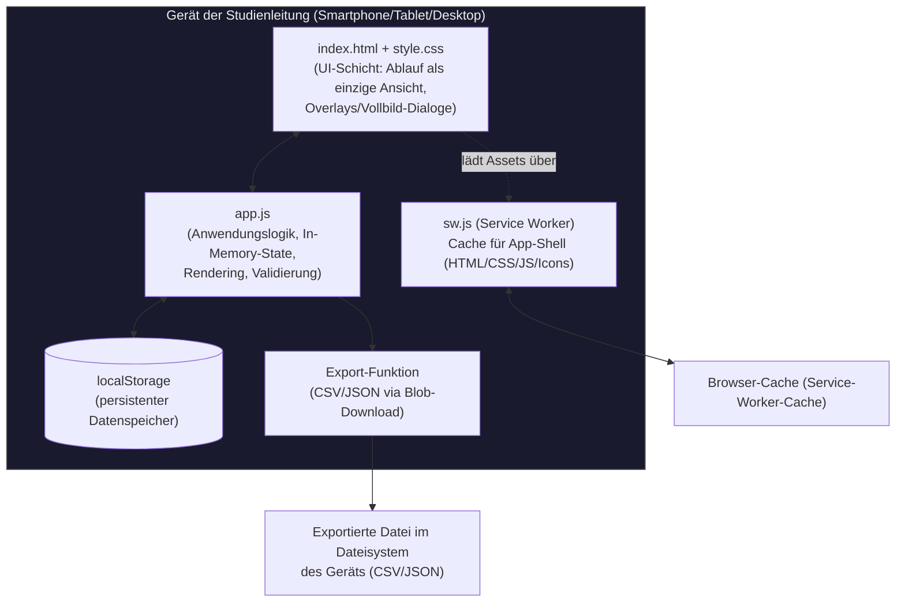

# StudyLog-V2 — Überblick

> Teil der technischen Dokumentation in `/docs`. Zielgruppe: neue Entwickler:innen,
> KI-Modelle ohne Chatverlauf, sowie Grundlage für eine datenschutzrechtliche Bewertung
> (DSGVO / Datenschutzfolgenabschätzung). Siehe auch [DATENFLUSS.md](./DATENFLUSS.md),
> [ARCHITECTURE.md](./ARCHITECTURE.md), [BEDIENUNG.md](./BEDIENUNG.md).

## Zweck (für Laien)

StudyLog ist ein digitales Protokollheft für Studienleitende, die Testpersonen durch
VR-gestützte Trainings- und Bewertungsszenarien führen (im Auslieferungszustand die
Szenarien Tutorial, Hologate und Rollercoaster). Statt Papierbögen wird auf dem Smartphone
gestoppt, notiert und bewertet, wer wann welches Szenario durchlaufen hat — inklusive
eines strukturierten Bewertungsbogens für die durchführende Trainingsleitung. Alle Daten
bleiben dabei ausschließlich auf dem jeweiligen Gerät.

Seit **v2.14.0** ist die App **eine einzige Ansicht: der Ablauf** — eine chronologische
Schrittliste des gesamten Studienablaufs (feste Schrittfolge Schritte 1–15, seit v2.32.0).
Links die Schritt-Leiste (mit eigener Scrollbar), rechts das Detailfeld für den gewählten
Schritt; auf dem Smartphone klappt der Schritt in der Liste auf. Zu jedem Schritt (der
Zeitfelder hat) werden pro Teilnehmende:r Start- und Endzeit erfasst (Button „Jetzt" oder
manuelle Eingabe); eine Farbcodierung (grau = offen, gelb = angefangen, grün = Start und
Ende erfasst) gibt den Überblick. „✓ Weiter" öffnet den nächsten Schritt, per Tap in der
Leiste kann jederzeit frei gesprungen werden. Einen separaten Anmerkung-Punkt je Schritt
gibt es seit v2.30.0 nicht mehr — freie Anmerkungen gehören in den Bereich „Ereignisse /
Probleme / Anmerkungen" (an jedem Schritt außer Schritt 8/11), das war sonst doppelt.

Die frühere Tab-Navigation entfällt. Einstellungen liegen hinter dem ⚙-Icon oben rechts
(Overlay) — seit v2.31.0: Bezeichnungen der 5 Hologate-Durchläufe (Schritt 7) anpassen,
Ereignis-Kategorien verwalten (Bearbeiten/Hinzufügen/Löschen), „Alle Daten löschen"; die
frühere Option „Mehrere Teilnehmende gleichzeitig" entfiel (ohne Wirkung auf den heutigen
Ablauf, da sie nur die inzwischen unerreichbaren Sitzungsaufzeichnungs-/Bewertungs-Screens
betraf). **Schritt 1 (Aufklärung + Einverständnis)** ist beim Start direkt geöffnet und hat
keine Zeitfelder — dort wird die Person angelegt („＋ Teilnehmende:n anlegen"), danach geht
es automatisch zu Schritt 2 (Sensorik). Weitere Personen über ＋ oben; bearbeiten über ✎.
Der CSV/JSON-Export (im letzten Schritt, 15) öffnet einen Vollbild-Dialog aus dem Ablauf heraus.
Direkt im Ablauf erfasst werden inzwischen: **Sensorik-Checkliste** (Schritt 2 — Items
Shimmer / Brustgurt / Uhr, je mit Anlege-Zeitstempel), **VR-Szenario-Durchlauf** an Schritt 7
(fünf feste Hologate-Durchläufe — Scheiben/Köpfe/Laufen/Drohnen/Kombi) und Schritt 10
(Rollercoaster, seit v2.32.0 ebenfalls genau **ein** fester Durchlauf ohne „+ Durchlauf
hinzufügen"/Overlay) — beide direkt im Schritt-Panel, ohne eigene Schritt-Zeiterfassung: das
Start/Ende der jeweiligen Schritt-Zeitfelder meint seither ausdrücklich den VR-Szenario-
Durchlauf selbst; Start/Ende jedes Durchlaufs werden seit v2.29.0 **wie normale Zeitfelder**
erfasst (Button „Jetzt" oder manuelle Eingabe/Korrektur), die übrigen Phasen bleiben reine
Häkchen. **Schritt 6 (Tutorial)** hat seit v2.28.0 **wieder** normale Start-/Ende-Felder wie
Schritt 4 „TMS", seit v2.29.1 beschriftet als „Start (VR-Tutorial)"/„Ende (VR-Tutorial)" mit
Hinweistext, dass explizit das VR-Szenario-Tutorial gemeint ist — nicht die vorangehende
Einweisung bzw. der gesamte Schritt; die drei Zwischenschritte „Person kalibriert" / „Person
durchläuft das Tutorial" / „Direkt ins VR-Szenario gewechselt" werden als reine, nicht
abhakbare Ablauf-Erinnerung angezeigt. **Trainerbewertungsbogen** (seit v2.27.0 **eigener Schritt**
direkt nach dem jeweiligen VR-Durchlauf statt eingebettet an einem Fragebogen-Schritt: Schritt
8 bewertet alle Hologate-Szenarien aus Schritt 7 gemeinsam, ohne das Tutorial; Schritt 11
bewertet nur den Rollercoaster-Durchlauf inkl. des in der Szene enthaltenen Schießens — seit
v2.16.0 inhaltlich reduziert auf den Block „Vergleich zur Selbsteinschätzung", 4 Items; seit
v2.29.0 **direkt im Schritt** ausfüllbar, kein Overlay/„anlegen"-Button mehr, Antworten
speichern sofort, weder Schritt 8 noch 11 haben einen Ereignis-Button),
**Ereignisse/Probleme/Anmerkungen** (an jedem anderen Schritt, Zeitpunkt oder Zeitraum —
seit v2.30.0 auch Ziel für freie Anmerkungen, siehe oben). Die Fragebogen-Schritte 3/5/9/12 sind seit
v2.26.1 einheitlich aufgebaut: keine Start/Ende-Zeiterfassung, nur eine Bestätigungs-Checkbox
„Fragebogen ausgefüllt" (färbt den Schritt grün). Die separaten Schritte zum An-/Ablegen von
VR-Equipment (Hologate) bzw. der VR-Brille (Rollercoaster) entfallen seit v2.27.0 ersatzlos,
der Schritt „Verabschiedung" seit v2.32.0 ebenfalls ersatzlos. **Stop Sensorik (Schritt 13)**
erfasst seit v2.32.0 nur noch einen einzelnen Zeitpunkt („Aufzeichnung beendet") statt
Start/Ende. **Sensorik ablegen (Schritt 14)** hat seit v2.32.0 eine eigene Sensorik-Checkliste
(dieselben drei Items wie beim Anlegen in Schritt 2, aber eigener Datenspeicher/Zeitstempel je
Item). Der letzte Schritt, **Datensicherung/Desinfektion (Schritt 15)**, besteht seit v2.32.0
nur noch aus zwei Häkchen **ohne** Zeiterfassung — „Alle Daten gesichert" (LSL, App, Sensorik,
Varjo Base) und „Alles desinfiziert/aufbereitet"; sind beide gesetzt, erscheint ein Button
„↻ Nächsten Durchlauf starten", der den Ablauf wieder bei Schritt 1 öffnet, ohne die Daten der
bisherigen Person zu verändern. Seit v2.33.0 zeigt derselbe Schritt zusätzlich die
**Gesamtdauer** (inkl. Datum) vom Anlegen der Person bis zum Sensorik ablegen, und der Button
**„⬇ Daten exportieren"** ist hervorgehoben sowie vor den beiden Häkchen platziert.
Der CSV/JSON-Export **exportiert seit v2.33.0 alle im Ablauf erfassten Daten** jeder/jedes
Teilnehmenden auf diesem Gerät (Zeiten je Schritt, Sensorik-Checklisten, VR-Szenario-
Durchläufe, Trainerbewertungsbögen, Ereignisse/Probleme/Anmerkungen) statt wie zuvor auf der
alten, in der Praxis leeren Datenstruktur (`sl_sessions`/`sl_bewertungen`) zu basieren; die
alte Protokoll-Liste selbst hat weiterhin keinen Aufruf mehr.

## Zielgruppe / Anwendungskontext

- **Nutzende:** Studienleitungen / Trainer:innen, die vor Ort (z. B. an einer VR-Station)
  Sitzungen mit Teilnehmenden durchführen und protokollieren.
- **Betroffene Personen:** Teilnehmende (Proband:innen) an VR-Trainingsszenarien, die
  ausschließlich unter einem Pseudonym (festes Format: 1 Buchstabe, 4 Zahlen, 3 Buchstaben,
  z. B. `P1234ABC`) geführt werden — optional zusätzlich eine Sensoriknummer (1–12). Keine
  Klarnamen in der App.
- **Einsatzkontext:** Mehrere Studienleitungen nutzen die App parallel auf eigenen
  Smartphones/Tablets, jeweils unabhängig voneinander, vollständig offline. Es gibt keine
  zentrale, geräteübergreifende Instanz der App.
- **Themenfeld der Szenarien:** im Auslieferungszustand Tutorial, Hologate, Rollercoaster
  (früher VR-Welt / Verkehrsunfall / Krankenhaus; über den Szenario-Manager frei änderbar).
  Der eingebaute Trainerbewertungsbogen (Dimensionen "Lageerkundung", "Entscheidungsqualität",
  "Führung und Kommunikation" u. a., inkl. des Begriffs "MANV") deutet weiterhin auf einen
  Einsatz im Bereich Rettungswesen/Notfalltraining hin.
  TODO: Datenschutz prüfen — konkreter Studienkontext und Rechtsgrundlage der
  Datenverarbeitung sind der App selbst nicht zu entnehmen und sollten für eine DSFA
  gesondert dokumentiert werden.

## Technischer Aufbau

| Aspekt | Ausprägung |
|---|---|
| Sprachen | Vanilla JavaScript (ES6+), HTML5, CSS3 |
| Frameworks/Libraries | **Keine** — kein React/Vue/jQuery, kein Build-Tool, kein Bundler |
| Build-Schritt | **Keiner** — Dateien werden unverändert ausgeliefert |
| Datenhaltung | Ausschließlich `localStorage` des Browsers (Web Storage API), geräte- und browserlokal |
| Offline-Fähigkeit | Service Worker (`sw.js`), Cache-first-Strategie |
| Plattform | Progressive Web App (PWA), installierbar auf iOS/Android/Desktop über "Zum Home-Bildschirm" |
| Deployment | Statisches Hosting via GitHub Pages, kein eigener Server |
| Externe Dienste/APIs | **Keine.** Keine Netzwerkaufrufe zu Drittsystemen, kein Tracking, keine Analytics, kein Backend |
| Hardware-Abhängigkeiten | Keine direkte Hardware-Anbindung durch die App selbst (siehe Hinweis unten zu "Sensorik") |
| Sprache der Oberfläche | Deutsch |

**Wichtiger Hinweis zu "Sensorik":** Die App liest keine Sensor-/Messdaten (z. B. Eyetracking,
Bewegungsdaten) aus. "Sensoriknummer", die Felder "Sensorik angelegt/abgelegt" und die
Checkliste im Tab **Sensorik** (Items Shimmer / Brustgurt / Uhr
mit jeweiligem Anlege-Zeitpunkt **je Teilnehmende:r**) sind **manuell durch die Studienleitung erfasste Metadaten**
(welche nummerierte Sensor-Hardware-Einheit einer Person zugeordnet wurde, und wann welche
Sensorik an-/abgelegt wurde) — nicht die Rohdaten des Sensors selbst. Details siehe
[DATENFLUSS.md](./DATENFLUSS.md).

## Architekturübersicht (High-Level)

Es gibt **keine Server-Komponente** und **keine Kommunikation zwischen Geräten**. Jede
Installation der App ist eine eigenständige, isolierte Instanz. Der einzige Weg, Daten von
einem Gerät wegzubekommen, ist der manuelle CSV/JSON-Export (siehe
[DATENFLUSS.md](./DATENFLUSS.md)).

### Module/Komponenten

| Datei | Rolle |
|---|---|
| `index.html` | App-Shell: **`#screen-ablauf` ist die einzige aufgerufene Ansicht.** Weiter im Markup vorhanden, aber ohne Navigation: `#screen-probanden` und `#screen-export` (Vollbild-Dialoge mit `[data-back-to-ablauf]`, aus dem Ablauf geöffnet) sowie `#screen-sensorik`/`#screen-session`/`#screen-log`/`#screen-bewertung`/`#screen-ereignisse` (derzeit ohne Aufrufpfad, warten auf Einbettung in Schritte). Einstellungen als `#settings-overlay`. Topbar (alle Breiten): App-Name links, ⚙ rechts |
| `style.css` | Dark-Mode-Design; Ablauf ab 768px zweispaltig (Schritt-Leiste links mit eigener Scrollbar + Detailfeld rechts), darunter einspaltig mit Inline-Aufklappen |
| `app.js` | Gesamte Anwendungslogik: State-Verwaltung, Persistenz (`localStorage`), Rendering aller Screens, Event-Handling, Export |
| `sw.js` | Service Worker: cached die App-Shell-Dateien für Offline-Nutzung, Cache-Invalidierung über Versionsnummer |
| `manifest.json` | PWA-Manifest (Name, Icons, Startverhalten) |
| `icons/` | App-Icons für Homescreen-Installation |

Details zu Modulen und Datenmodellen: siehe [ARCHITECTURE.md](./ARCHITECTURE.md).
